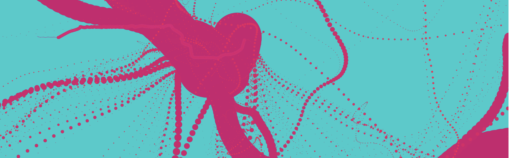
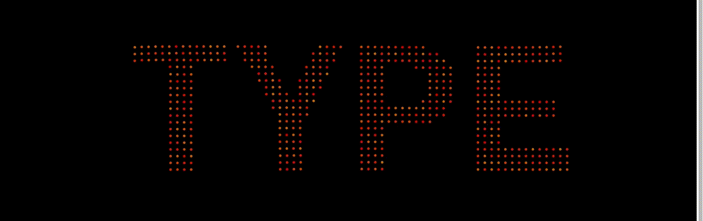

Generative Design
=================
Generative design is an iterative process that allows a range of design options to be explored. Constraints are set by the designer, and many results can be generated within these constraints. This is a collection of some generative design pieces created as part of a final year Creative Coding module.

[Wallpaper Generator](FlowfieldWallpaper/BookCover_Final_Origin)
-------------------
This project allows users to generate and save a wallpaper for a mobile device. Perlin noise was used for the design to create a path for particles to follow. The colour of the particles and the magnitude of the perlin noise path can be adjusted by the user to create a variety of interesting results.

[Particle Typography](ParticleTypography)
-------------------
This project allows the user to type an input and have that input text form as particles. The particles move pseudo-randomly around the screen and animate towards the points of a text graphic when the text is input.

[Alphabet Soup](AlphabetSoup)
-------------
This project was developed during a workshop hosted by Hartmund Bohnacker, author of 'Generative Design: Visualize, Program, and Create with JavaScript in p5.js'. The project takes in text input from the keyboard and places it into a bowl of alphabet soup. The mouse can then influence the position of the characters in the soup.

[Shape Experiments](ShapeExperiments)
----------------
